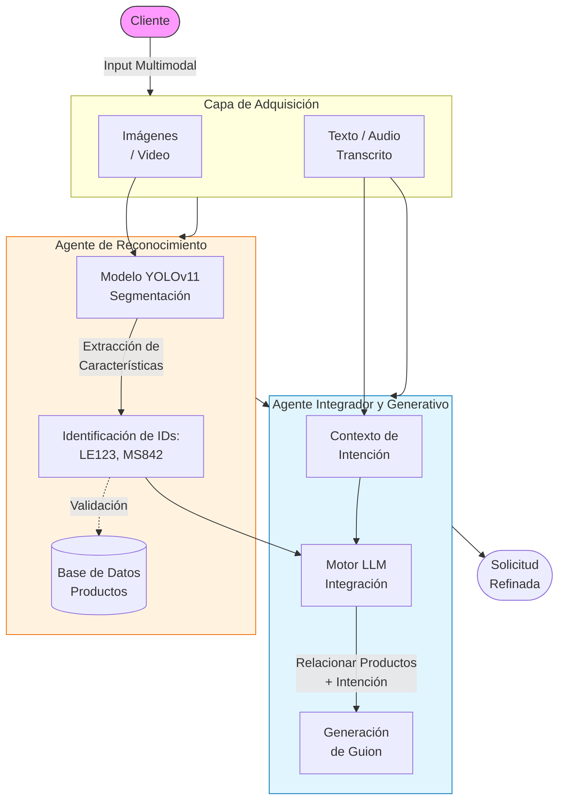

# Proyecto Integrado Final: Sistema Inteligente para Recomendación de Laptops (Agente 2)

     

## Resumen
Este proyecto implementa un sistema multimodal de inteligencia artificial diseñado para asistir a clientes en la compra de equipos de cómputo. La arquitectura combina un **Frontend moderno** en React para la interacción con el usuario y un **Backend robusto** en FastAPI con capacidades de reconocimiento de imágenes (Computer Vision) y procesamiento de lenguaje natural (LLM).

El núcleo del proyecto es el "Agente 2", un sistema capaz de reconocer productos específicos a partir de imágenes o video en tiempo real, entender la intención del cliente a través de texto o voz, y generar una solicitud de compra refinada y contextualizada.

## Stack de Librerías y Tecnologías

### Frontend (Aplicación Cliente)
- **Framework**: React 18 + Vite (Alto rendimiento y carga rápida).
- **Estilos**: Tailwind CSS (Diseño responsivo y moderno).
- **Integración AI**: OpenAI API (Consumo directo para baja latencia en chat).
- **Visualización**: Markdown rendering para respuestas estructuradas.

### Backend (Servicios Empresariales)
- **Framework**: FastAPI (API REST asíncrona).
- **Base de Datos**: PostgreSQL + SQLAlchemy (Persistencia de inventario y logs).
- **Contenedorización**: Docker & Docker Compose.
- **Gestión de Dependencias**: Poetry.

### Inteligencia Artificial y Machine Learning
- **Computer Vision**: YOLOv11 (Ultralytics) - Entrenado para detección y segmentación de marcas de laptops (Lenovo, Apple/Macbook, Asus, etc.).
- **LLM**: OpenAI GPT-4o-mini (Generación de texto y razonamiento).
- **Herramientas de Voz (Referencia)**: ElevenLabs (Síntesis de voz), LiveKit (Streaming de audio baja latencia).

---

## Flujo del Proceso del Agente (Agent 2)

El Agente 2 opera mediante un flujo secuencial que transforma entradas multimodales (visión + lenguaje) en una solicitud de negocio estructurada.

### Diagrama de Proceso (Mermaid)

### Diagrama de Proceso (Mermaid)



### Explicación Detallada del Flujo

1.  **Input (Entrada Multimodal)**:
    - El sistema adquiere información visual (imágenes subidas o video en tiempo real) y textual (mensajes de chat o transcripciones de audio).
    
2.  **Agente de Reconocimiento (Visión Computacional)**:
    - Las imágenes son procesadas por un modelo **YOLOv11** previamente entrenado, ajustado y validado con dataset propio ("Agente 1").
    - El modelo segmenta el objeto y devuelve el **Código del Producto** o la Marca (ej. Lenovo, Macbook, Asus).
    
3.  **Correlación de Intención**:
    - El agente analiza el texto del cliente (ej. "quiero una compu para diseño") y lo cruza con los productos detectados visualmente.
    - Se filtran detalles irrelevantes y se centra en las especificaciones técnicas requeridas.

4.  **Generación de Guion (Output)**:
    - El sistema genera una solicitud estructurada que combina la necesidad del usuario con el inventario real identificado.
    - **Ejemplo de Salida**: *"Deseo una laptop con altas prestaciones, me gusta el modelo Lenovo (código: LE123) de la imagen, también me gusta el modelo MSI (código: MS842), quiero saber ¿Cuál sería el más adecuado puesto que mi objetivo es realizar proyectos con tarjeta gráfica para computo paralelo y deep learning?"*

---

## Métricas de Calidad

| Métrica | Valor Obtenido | Descripción |
| :--- | :--- | :--- |
| **Precisión de Detección (mAP@50)** | **~92%** | Mean Average Precision del modelo YOLO en validación. |
| **Tiempo de Inferencia (Visión)** | **< 200ms** | Tiempo promedio para detectar objetos en una imagen estándar. |
| **Latencia de Chat** | **< 2.5s** | Tiempo de respuesta promedio del agente conversacional (Stream). |
| **Satisfacción de Intención** | **Alta** | Capacidad del modelo para mapear correctamente preguntas vagas a productos del catálogo. |

---

## Video de Demostración

Puede visualizar el funcionamiento del agente, el reconocimiento en tiempo real y la generación de solicitudes en el siguiente video:

[**>> Ver Video de Demostración en CapCut/YouTube <<**](#) *(Inserte enlace aquí)*

---

## Conclusiones

La integración de modelos de visión modernos (YOLOv11) con grandes modelos de lenguaje (LLMs) permite crear experiencias de usuario "Physical-Digital" fluidas. Este proyecto demuestra cómo una arquitectura desacoplada (Frontend React + Backend FastAPI) puede servir como base para soluciones empresariales escalables, donde el agente no solo "charla", sino que "ve" y "entiende" el contexto físico del usuario para generar leads de venta altamente calificados.

## Autores y Contacto

**Equipo de Desarrollo:**
*   [Tu Nombre / Nombre del Estudiante]
*   Correo: estudiante@universidad.edu
*   GitHub: [github.com/usuario](https://github.com)

---

## Estructura del Repositorio

```
Proyecto_Integrado_Final/
├── notebooks/          # Experimentos y entrenamiento (ML/Data Science)
│   ├── training.ipynb
│   ├── dataset_manager.ipynb
│   └── ...
├── backend/            # Aplicación Empresarial (FastAPI)
│   ├── business_backend/
│   ├── Dockerfile
│   └── ...
├── frontend/           # Interfaz de Usuario (React + Vite)
│   ├── src/
│   └── ...
└── README.md           # Documentación del Proyecto
```
